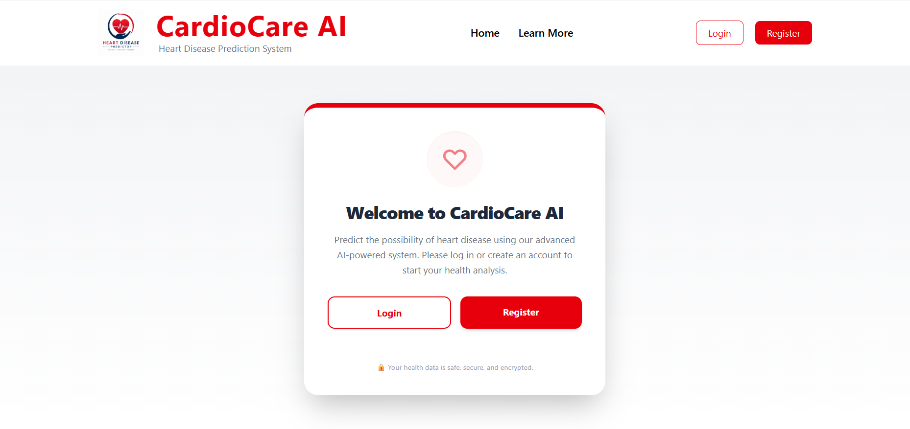

# Heart Disease Prediction System

## 📌 Project Overview

The **Heart Disease Prediction System** is a full-stack web application designed to predict the likelihood of heart disease based on user-provided medical information.

The application combines a modern web interface with a Machine Learning model to provide predictions and recommendations. Users can register, log in securely, submit health-related information, view prediction results, and access their previous prediction history.

The project follows a microservice-style architecture where the frontend, Node.js backend, and Machine Learning API communicate with each other.

---

## ✨ Features

* User Registration and Login
* JWT-based Authentication
* Protected Routes
* Heart Disease Prediction using Machine Learning
* Personalized Prediction Result and Recommendation
* Prediction History for Logged-in Users
* User Profile Management
* Update Profile Information
* Forgot Password Functionality
* OTP-based Password Verification
* Password Reset
* Email OTP using Nodemailer
* Secure Password Storage
* Input Validation
* MongoDB Database Integration

---

## 🛠️ Tech Stack

### Frontend

* React
* Vite
* React Router DOM
* Axios
* Tailwind CSS

### Backend

* Node.js
* Express.js
* JWT Authentication
* Nodemailer
* Axios
* dotenv

### Machine Learning API

* Python
* FastAPI
* Scikit-learn
* Logistic Regression
* Joblib / Pickle

### Database

* MongoDB
* Mongoose

---

## 🏗️ System Architecture

```text
                ┌───────────────┐
                │   User        │
                └───────┬───────┘
                        │
                        ▼
                ┌───────────────┐
                │ React Frontend│
                │    (Vite)     │
                └───────┬───────┘
                        │
                        ▼
                ┌───────────────┐
                │ Express.js    │
                │    Backend    │
                └───────┬───────┘
                        │
          ┌─────────────┴─────────────┐
          │                           │
          ▼                           ▼
 ┌─────────────────┐         ┌─────────────────┐
 │   MongoDB       │         │   FastAPI       │
 │   Database      │         │    ML API       │
 └─────────────────┘         └────────┬────────┘
                                      │
                                      ▼
                             ┌─────────────────┐
                             │ Logistic        │
                             │ Regression      │
                             │ ML Model        │
                             └─────────────────┘
```

---

## 📂 Project Structure

```text
Heart-Disease-Prediction/
│
├── backend/
│   ├── config/
│   │   └── db.js
│   │
│   ├── middleware/
│   │   └── authMiddleware.js
│   │
│   ├── models/
│   │   ├── User.js
│   │   ├── prediction.js
│   │   └── otp.js
│   │
│   ├── routes/
│   │   └── authRoutes.js
│   │
│   ├── utils/
│   │   └── sendEmail.js
│   │
│   ├── index.js
│   └── package.json
│
├── frontend/
│   ├── public/
│   │
│   ├── src/
│   │   ├── components/
│   │   │   ├── Footer.jsx
│   │   │   └── Navbar.jsx
│   │   │
│   │   ├── pages/
│   │   │   ├── Home.jsx
│   │   │   ├── Register.jsx
│   │   │   ├── Login.jsx
│   │   │   ├── Prediction.jsx
│   │   │   ├── Result.jsx
│   │   │   ├── History.jsx
│   │   │   ├── Profile.jsx
│   │   │   ├── ForgetPassword.jsx
│   │   │   ├── VerifyOtp.jsx
│   │   │   └── ResetPassword.jsx
│   │   │
│   │   ├── services/
│   │   │   └── api.js
│   │   │
│   │   ├── App.jsx
│   │   └── main.jsx
│   │
│   └── package.json
│
├── ml_api/
│   ├── app.py
│   ├── Logictic_Regression_heart.pkl
│   ├── heart_columns.pkl
│   └── heart_scaler.pkl
│
└── README.md
```

---

## 🤖 Machine Learning Model

The application uses a **Logistic Regression** machine learning model to predict the likelihood of heart disease.

The model processes medical information such as:

* Age
* Gender
* Chest Pain Type
* Resting Blood Pressure
* Cholesterol Level
* Fasting Blood Sugar
* Resting ECG
* Maximum Heart Rate
* Exercise-Induced Angina
* Oldpeak
* ST Slope

The FastAPI service processes the input data and returns the prediction and recommendation to the Express backend.

---

## 🔐 Authentication Flow

The application uses JWT authentication to protect user-specific features.

```text
Register
   ↓
Login
   ↓
JWT Token Generated
   ↓
Token Stored on Frontend
   ↓
Protected API Request
   ↓
Authentication Middleware
   ↓
Access Granted
```

Protected features include:

* Heart Disease Prediction
* Prediction History
* User Profile
* Profile Update

---

## 🔑 Forgot Password Flow

The application provides an OTP-based password recovery system.

```text
Forgot Password
       ↓
Enter Registered Email
       ↓
OTP Generated
       ↓
OTP Saved in Database
       ↓
OTP Sent via Email
       ↓
Verify OTP
       ↓
Reset Password
       ↓
Login with New Password
```

The OTP is valid for **10 minutes**.

---

## 🚀 Running the Project Locally

### 1. Clone the Repository

```bash
git clone https://github.com/Pragati-jain748/Heart-Disease-Prediction.git
```

Move into the project folder:

```bash
cd Heart-Disease-Prediction
```

---

## 💻 Run the Backend

Move to the backend folder:

```bash
cd backend
```

Install dependencies:

```bash
npm install
```

Create a `.env` file and add the required environment variables:

```env
MONGO_URI=your_mongodb_connection_string
JWT_SECRET=your_jwt_secret
EMAIL_USER=your_email
EMAIL_PASS=your_email_app_password
```

Run the backend:

```bash
node index.js
```

The backend runs on:

```text
http://localhost:5000
```

---

## 🧠 Run the Machine Learning API

Move to the ML API folder:

```bash
cd ml_api
```

Install the required Python packages:

```bash
pip install fastapi uvicorn scikit-learn pandas numpy joblib
```

Run the FastAPI server:

```bash
uvicorn app:app --reload
```

The ML API runs on:

```text
http://127.0.0.1:8000
```

---

## 🎨 Run the Frontend

Move to the frontend folder:

```bash
cd frontend
```

Install dependencies:

```bash
npm install
```

Start the development server:

```bash
npm run dev
```

---

## 📡 Application Flow

```text
User
  ↓
React Frontend
  ↓
Express Backend
  ↓
FastAPI ML API
  ↓
Machine Learning Model
  ↓
Prediction Result
  ↓
MongoDB Prediction History
```

---

## 🔒 Environment Variables

The following environment variables are required for the backend:

```env
MONGO_URI=
JWT_SECRET=
EMAIL_USER=
EMAIL_PASS=
```

> ⚠️ Never upload your `.env` file or sensitive credentials to GitHub.

---

## 🌐 Deployment

The application can be deployed using:

* Frontend → Vercel
* Express Backend → Render
* FastAPI ML API → Render
* Database → MongoDB Atlas

Deployment links will be added after the project is deployed.

---

## 📸 Screenshots

Screenshots of the application will be added here.

### Home Page



### Prediction Page


### Prediction Result


### Prediction History


### User Profile


---

## 🔮 Future Improvements

* Improve prediction accuracy using additional machine learning models
* Add more detailed health recommendations
* Add data visualization for prediction history
* Improve UI responsiveness
* Add email notifications
* Add stronger security features
* Compare multiple machine learning algorithms

---

## 👩‍💻 Author

**Pragati Jain**

GitHub: [Pragati-jain748](https://github.com/Pragati-jain748)
